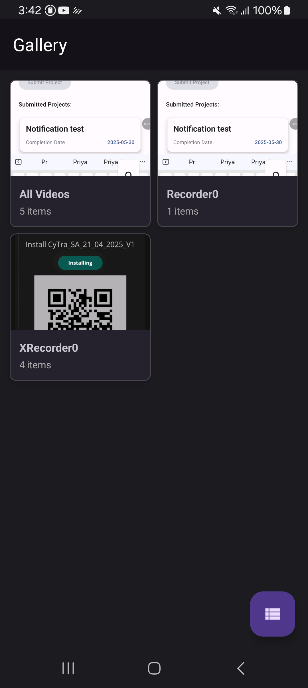
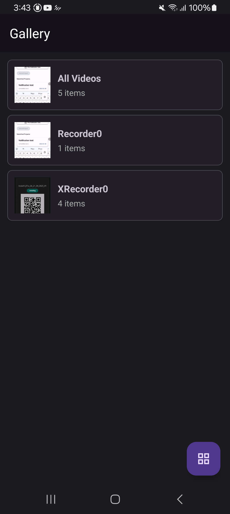
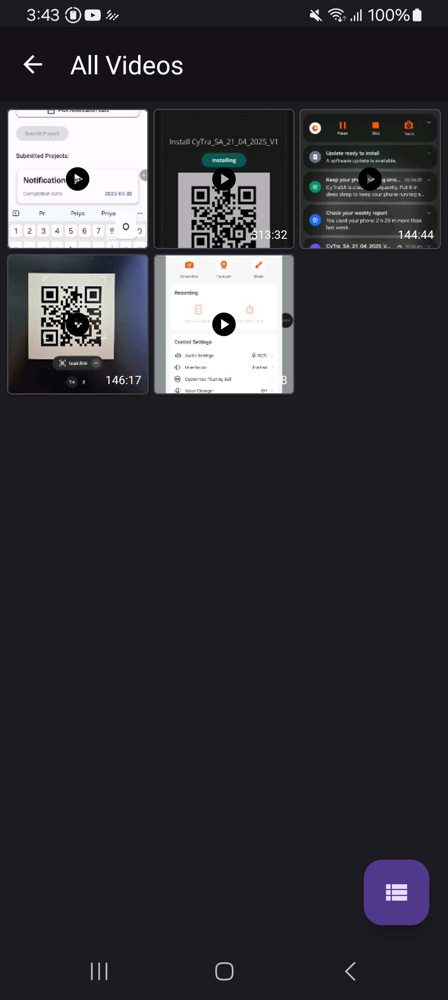

# 📸 GalleryApp

**GalleryApp** is a modern Android application that displays device media—images and videos—grouped by folders. It allows toggling between grid and list views for an intuitive media browsing experience.

Built using the latest Android best practices with **MVVM**, **Hilt**, **Coroutines**, and **StateFlow**.

---

## 🚀 Features

- 📁 Displays albums grouped by folders (Camera, WhatsApp, Screenshots, etc.)
- 🖼 Shows image and video thumbnails
- 🔄 Swipe-to-refresh support
- 🗂 Grid/List view toggle using FAB
- 📂 Album detail screen to view media inside the folder
- 🔐 Handles runtime permissions and Android 13+ media access

---

## 📁 Project Structure

```
com.suraj.gallery/
│
├── data/
│   ├── local/           # MediaStore access to fetch albums and media
│   ├── model/           # Data models (Album, MediaItem)
│   └── repository/      # MediaRepositoryImpl
│
├── di/                  # Hilt modules
│   ├── AppModule.kt
│   ├── RepositoryModule.kt
│   └── UseCaseModule.kt
│
├── domain/
│   ├── model/           # Domain models (clean architecture)
│   ├── repository/      # MediaRepository interface
│   └── usecase/         # GetAlbumsUseCase
│
├── presentation/
│   └── ui/
│       ├── albums/      # Albums screen
│       ├── detail/      # Album detail screen
│       └── common/      # ViewState, view toggling
│
├── utils/               # File extensions, media format utils
├── GalleryApplication.kt
├── res/                 # Layouts, drawables, strings
└── AndroidManifest.xml
```

---

## 🧰 Tech Stack

| Technology            | Role                                  |
|-----------------------|----------------------------------------|
| Kotlin                | Programming language                   |
| MVVM                  | Architecture pattern                   |
| Hilt                  | Dependency injection                   |
| Coroutines + StateFlow| Async tasks and UI state management    |
| ViewModel             | Lifecycle-aware UI logic               |
| ViewBinding           | View access without `findViewById`     |
| Glide                 | Image and video thumbnail loading      |

---

## 🧪 Testing

### ✅ Unit Tests

- `AlbumsViewModelTest` verifies:
    - Album loading success and error states
    - Grid/List view toggle logic
    - Retry mechanism on error

### 📱 UI Tests

- `AlbumsActivityTest` verifies:
    - Rendering albums in RecyclerView
    - FAB toggle behavior
    - Navigation to AlbumDetail screen
    - Swipe refresh

> Testing uses `MockK`, `JUnit`, `Espresso`, `HiltAndroidRule`, and `GrantPermissionRule`.

```bash
./gradlew testDebugUnitTest       # Run unit tests
./gradlew connectedAndroidTest    # Run instrumentation tests
```

---

## 📸 Screenshots

| Grid View | List View | Album Detail |
|-----------|-----------|--------------|
|  |  |  |


---

## ▶️ How to Use

### 1. Clone the Repository

```bash
git clone https://github.com/SurajBahadur/GalleryApp.git
cd GalleryApp
```

### 2. Open in Android Studio

- Open the folder using Android Studio
- Let Gradle finish syncing

### 3. Build and Run

- Connect a device or emulator (API 23+)
- Run the app using the **Run** button ▶️

> On Android 13+, permissions for `READ_MEDIA_IMAGES`, `READ_MEDIA_VIDEO`, and optionally `READ_MEDIA_VISUAL_USER_SELECTED` are handled.

---

## 📄 License

```
MIT License

Copyright (c) 2025 Suraj Bahadur

Permission is hereby granted, free of charge, to any person obtaining a copy
of this software and associated documentation files (the "Software"), to deal
in the Software without restriction...
```
